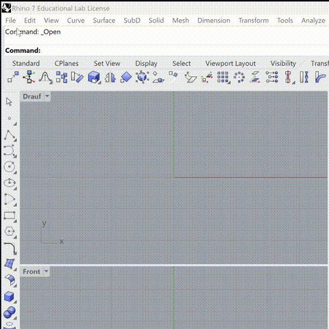
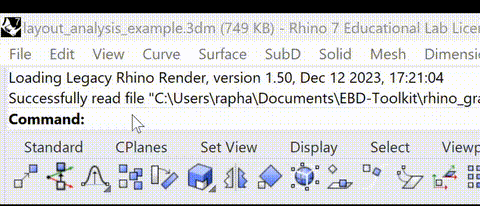
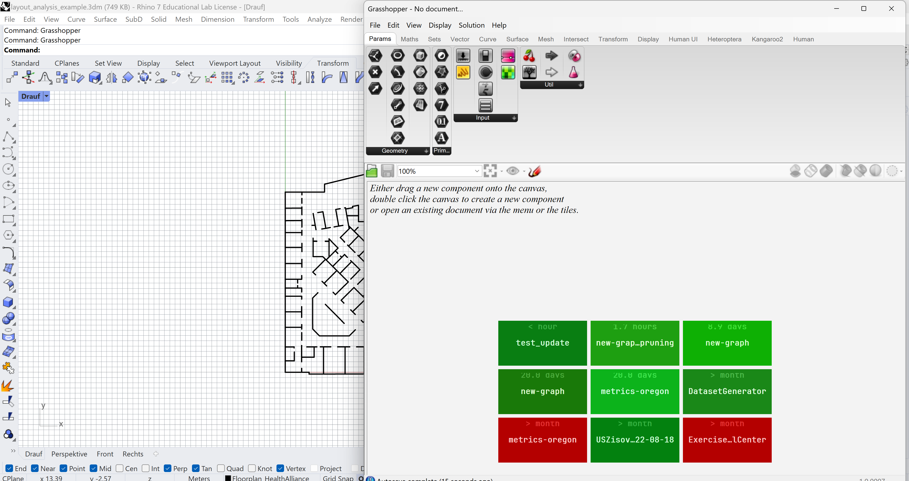

# Topological Analysis of Hospital Layouts
The goal of this exercise will be to design an intervention in an existing hospital design such that it will improve at least two of the measures presented in of week 6.

**Circulation complexity: Inter-Connected Density (ICD)**, (O’Neill, 1991): ICD is the mean number of potential paths from any decision point within the floor plan. 
> Lower  ICD is correlated with better wayfinding 

**Nursing routine efficiency: Yale Traffic Index (YTI)** (Thompson and Goldin, 1975)
The relative trip frequencies of selected traffic links multiplied by the distance between links. 
> Lower YTI is associated with more efficient nursing routines 

**Quality of Care:  Spatial Communication Index (SCI)** (Pachilova and Sailer, 2020): SCI is the accumulated visibility for key traffic links in a ward divided by the number of beds. 
> Higher SCI is correlated with better quality of care 

To do so, you will use the EBD-Toolkit.
During this exercise, you can work in groups of at most **two** people.

## Submission Details 
- **Submission date**: 06.11.2024, 17:59 CET
- **Submission materials**:
  - A presentation on this exercise (max. 10 slides, max. 5 minutes, exceeding this will result in grade penalty). File name: Your group member's last name delimited by `_`. Example: If your group consists of _A. Einstein_, _M. Curie_ → `einstein_curie.pdf`. [Upload link](https://polybox.ethz.ch/index.php/s/JM2OE5ScX8YzOwS)
  - The Rhino file with your base layout and intervention. [Upload Link](https://polybox.ethz.ch/index.php/s/dDhETfq4UF3IGNj)
- **Presentation date**: TBD
- **Grading**: Total of 100 points (25 bonus points):
    - 25 points for the line drawing of the hospital layout
    - 25 points for the performance of the base layout
    - 40 points for the design intervention
    - 10 points for the presentation
    - 25 bonus points for the optional task

# 1 Getting Started

## 1.0 Getting Windows
This exercise will require you to work on a Computer with a Windows operating system. If you do not currently have access to such a machine, please consider the following options:
1. **Pair up with a student with a Windows Machine**: This exercise can be solved in groups. The easiest way to work around the Windows issue is to work in a group with a student who has access to a Windows machine and solve the exercise together.
2. **BootCamp**: If your machine is a MacBook and older than 2020 (so it does not yet have an M1 or M2 processor), you can install Windows on an additional partition using [BootCamp](https://support.apple.com/en-us/102622).

## 1.1 Installing Rhino 7
For the duration of this course, you will obtain a license for _Rhino 7_, a CAD software. If you already own Rhino 6 or Rhino 7 or later, you can skip this part.

>[!NOTE] 
>Even though at the time of writing this tutorial, a newer version of Rhino exists, the toolkit has only been tested for Rhino 7, so we cannot guarantee its functionality for newer versions of Rhino

Be sure to be on your Windows operating system. Visit the [Rhino Download Page](https://www.rhino3d.com/download/) and choose _Additional Downloads (bottom right)_ > _Rhino 7_ > _Create Account and Login_.

>[!IMPORTANT] 
>Remember the email address you have used, as you need it to obtain a license for Rhino 7. 

After creating the account, send an email with the header _Rhino License_ to rabaur@ethz.ch. You will then receive an invitation via email to join the team _COG ETHZ_. Follow the instructions in that email to obtain the license.
After logging in, choosing the language, and accepting the license agreement, you can download the installation executable and run it once the download has been completed.
First, you will be prompted to enter the email address you have previously used the create your Rhino account. If you have already accepted the invitation to the _COG ETHZ_ team, Rhino will automatically find your license and you can start up Rhino.

## 1.2 Installing the EBD-Toolkit
Now you will install the files that you will need to solve this exercise. To do so, we need software that manages the version of these files, i.e., knows which version of the files you currently have and whether there is a newer version available. This software is called _GitHub Desktop_.

### 1.2.1 Installing GitHub Desktop
GitHub Desktop is a user interface for the version-control tool _git_. We will use _git_ to download the latest version of the EBD-Toolkit and get the newest updates later.
>[!TIP]
> We only need to understand one single action: _pull_. Pull means: "Get the latest changes of the files, compare them to my current state, and integrate changes if there are any".

Visit [GitHub Desktop's website](https://desktop.github.com/) and click the _Download for Windows_ button. Install and open the tool. Upon opening, you will be prompted to create or sign into your GitHub account. Please create one if you have not already done so.

### 1.2.2 Installing the EBD-Toolkit Project
In GitHub Desktop, choose _File > Clone repository... > URL_ and enter the following URL: `https://github.com/rabaur/EBD-Toolkit.git`. Below, you will see where the toolkit will be saved on your system. Then, click _clone_. This will download the latest version of the files.
After the download, you can verify that the project has been saved to the indicated path.
>[!NOTE]
>There will be many more files than you will need in this exercise. The other files are important for later exercises (which is neat, you won't need to do this process twice). The relevant files for exercise 2 are located at `EBD-Toolkit/rhino_grasshopper_files`

At `EBD-Toolkit/rhino_grasshopper_files` you can find two files:
1. `layout_analysis_example.3dm`: This is a Rhino file, indicated by the extension `3dm`. It contains definitions for geometry. It will serve as an example in this exercise.
2. `layout_analysis.gh`: This is a file for [Grasshopper](https://www.grasshopper3d.com/), which allows for algorithmic modeling in Rhino, indicated by the extension `gh`. This file contains the recipe for computing spatial and topological measures on top of the geometry provided in the `3dm` files.

## 1.3 Installing Grasshopper Plugins
Hang in there, you nearly made it! This last step will be about installing the required plugins for Grasshopper.
First, open Rhino, and then open the example file by choosing _Files_ > _Open..._ > `<your_path>/EBD-Toolkit/rhino_grasshopper_files/layout_analysis_example.3dm`.

Then you can fire up Grasshopper by typing _Grasshopper_ into the _Command Line_ on the top left.

Your screen should now look something like this:

We can now try to load the Grasshopper file by choosing (in the new window) _Files_ > _Open Document..._ > `<your_path>/EBD-Toolkit/rhino_grasshopper_files/layout_analysis.gh`. However, you will most likely see a prompt warning you that several components have not been found. Don't worry, we are going to install them now.

>[!WARNING]
>Do **not** press _Download and Install_. This method has proven to be very unreliable, and more often than not leads to version conflicts between packages. Instead, you can install the packages manually.

The basic workflow of manually installing a Grasshopper Plugin is always the same:
1. Go to your plugin webpage. Usually, plugins are distributed via Rhino's plugin marketplace [Food4Rhino](https://www.food4rhino.com/en)
2. Once you found your plugin, scroll to the bottom. You will see at least one green _Download_ button. Sometimes there are multiple versions - usually choosing the newest one will work fine (unless it's for Rhino 8, then choose the newest one for Rhino 7 if available). Press _Download_.
3. Once the file has been downloaded, you will need to identify the _Components Folder_ that is used to store library files. In the Grasshopper window, click _File > Special Folders > Components Folder_. This will open the components folder in your file explorer.
4. Now it is time to "install" the plugin, which is just dragging it into the components folder. In step 2, you will have downloaded either:
	1. A file with the extension `gha`. This is a Grasshopper library file. Check that the file is readable by right-clicking on the file, then choosing _Properties_ > _Security_ > _Permissions for System_. All checkmarks should be allowed, otherwise, set them to be so. After that, drag and drop the file into the _Components Folder_ you opened in step three 
	2. A zip-compressed folder. You can proceed with this folder as if it was a library file in 4.1, after uncompressing it. After checking the permissions, you can drag the complete folder into the _Components Folder_ from step 3.
5. Restart Grasshopper and Rhino for the changes to take effect.

You will need to install 4 plugins by following the description above.
- [Human UI](https://www.food4rhino.com/en/app/human-ui) (Version 0.8.1.3)
- [Super Delaunay](https://www.food4rhino.com/en/app/super-delaunay#downloads_list) (First Release)
- [Shortest Walk GH](https://www.food4rhino.com/en/app/shortest-walk-gh)(Version 0.9.0014)
- [Decoding Spaces](https://toolbox.decodingspaces.net/download-decodingspaces-toolbox/): Please follow the installation procedure detailed on this website.

# 2 Line Drawing of a Hospital Typology (25 points)
The first task of this exercise will be to choose a hospital layout. You can choose any layout of a hospital ward (even if it is not realized yet), but as an inspiration, some classical ones can be found in the lecture notes of lecture week 6.
Once you have chosen a layout, please indicate the **building name**, **location**, **year of completion**, **architecture company** (if you can find out), and the names of your two group members in [this spreadsheet](https://docs.google.com/spreadsheets/d/1dzDzM0Xx3sM-ijmQHuQg438_4OrOFLIDdjyxTM_oeg4/edit?usp=sharing). It is first-come-first-serve: I a group has already chosen a layout, please search for a new one.

>[!NOTE]
>Remember, the goal of this exercise will be to _improve_ the layout according to performance measures presented in the lecture. When choosing a layout, please choose one that is also interesting for you to work on and one that sparks an idea for improvement.

Once you have chosen and obtained a reference image of the layout, you will model this layout as a line drawing in Rhino. To import and properly scale a reference, please watch the following tutorial.

>[!NOTE]
>For your layout, create a **new** Rhino file, do not use `layout_analysis_example.3dm` for this task. To do so, open Rhino, and choose _File_ > _New_ and then choose the template _Large Objects - Meters_. The reason for this is that the `layout_analysis_example.3dm` file will be overwritten in case we need to update the toolkit.

<iframe width="560" height="315" src="https://www.youtube.com/embed/sNSvc23sOOI?si=BreYmRXO_fAzmgE-" title="YouTube video player" frameborder="0" allow="accelerometer; autoplay; clipboard-write; encrypted-media; gyroscope; picture-in-picture; web-share" referrerpolicy="strict-origin-when-cross-origin" allowfullscreen></iframe>

Then, you can use Rhino's _Polyline_ and _Line_ tools to draw the floorplan lines. Use simple lines (no curves) to trace the walls of the floorplan. Make sure that lines that are supposed to connect are indeed connecting (watertight).

>[!IMPORTANT]
>**Output from this section (25 points):** Select a typology and describe its characteristics. Properly scale the reference image. Create a line drawing of the walls of the layout.

# 3 Design Intervention
## 3.1 Compute the performance of the base layout (25 points)
With your base design established, you will now use the EBD Toolkit to compute performance measures.

<iframe width="560" height="315" src="https://www.youtube.com/embed/95ZyYRJHaEk?si=fv9FFzvOabWfKh44" title="YouTube video player" frameborder="0" allow="accelerometer; autoplay; clipboard-write; encrypted-media; gyroscope; picture-in-picture; web-share" referrerpolicy="strict-origin-when-cross-origin" allowfullscreen></iframe>

Using the toolkit, it will be the goal to accommodate all of the following functions in the layout:
- **Patient Room**: A room or place where one or multiple patients are treated
- **Nurse Station**: A station where nurses chart, communicate, get/dispose of material
- **Utility Room**
- **Elevator**: This can also substitute for any entrance into the layout
- **Elevator Lobby**: Any larger entrance area
- **Medical Clinic**: Room to perform more involved medical procedures such as X-rays, surgeries, and casks.
- **Medication Room**: Room where medication is stored
- **Janitor Closet**: Room that houses cleaning or building maintenance utilities. Could also be an "Ausguss".
Although not always possible, try to infer as many of these functions from your reference layout. If you cannot find one of them, place them at your discretion.
>[!IMPORTANT]
>**Output from this section (25 points)**: Assign all functions as described. Make a screenshot of the Control Window, and log the values of the three metrics. Make a screenshot of the layout in the Rhino view.

## 3.1 Perform Design Intervention (40 points)
Now that you have established the performance of the base layout, you can plan and execute the intervention.
The goal is to improve at least **2 out of the 3 measures** while retaining the same capacity (same number of patient beds) and functions. An improvement counts as the following:
- **ICD**: A decrease in ICD
- **YTI**: A decrease in YTI
- **SCI**: An increase in SCI
Such changes can be achieved in two main ways:
- **Modify the program**: By finding a more efficient allocation of the room, you can decrease YTI. Will this lower the SCI? Argue why such a rearrangement will still make sense architecturally (don't blindly optimize for efficiency).
- **Modify the layout**: You can change the layout directly (place, remove, or modify walls). Note that it is probably undesirable to make a full redesign (think economically). Make educated, minimal changes that have a great effect.

Please not directly modify the base layout. Instead, create a new layer in Rhino and make your changes there. This way, we can compare the base layout with the intervention layout.

>[!IMPORTANT]
>**Output from this section (40 points)**: Conceptualize and execute a design intervention. Create a second line drawing of your intervention. Improve 2 out of 3 measures. Reflect on the intervention - did your changes translate into expected changes? What was unexpected?

# 4 Presentation (10 points)
Finally, tie all your outputs together in a short (max. 5 minutes and max. 10 slides, longer presentations will incur grade penalties). In particular, the presentation should include the following:
- A description of the layout you chose with all the additional information about the layout you were able to find (use output of 2)
- An image of the line drawing, explaining simplifications or alterations of the layout. Present where functions are allocated in the base layout (output of 2)
- Present the performance of the base layout. Identify areas for improvement to motivate your intervention (output of 3.1)
- Present the effects of your intervention. Is such an intervention feasible? Which additional steps would you consider to test your intervention?
- Reflect on the usefulness of these tools. Was it a new experience for you? Did you feel like they enabled or disabled your mode of designing?

# 5 Come up with your performance measure (optional) (+25 points)
>[!NOTE]
>This exercise is completely optional, but will yield 25 bonus points that can increase your grade beyond this exercise.

Are you interested to further delve into this topic? Armed with a bit of knowledge about Grasshopper, you can either:
- Devise a completely new measure
- Use existing building blocks to derive your measure
You can find/adapt a measure from the literature, or come up with something completely new. We are looking forward to your ideas!
